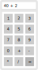

class: middle, center
background-image: url(assets/suru-wallpaper.png)

# Creating Ubuntu Phone Apps using Python and Qt

---

layout: false

# About me ...

Tim Süberkrüb

[github.com/tim-sueberkrueb](https://github.com/tim-sueberkrueb)

[twitter.com/TimSueberkrueb](https://twitter.com/TimSueberkrueb)


---

# Content Warning


*This presentation contains a high dosis of code examples.
Please consult your doctor or pharmacist about any risks and side effects.*

---

# Agenda

1. Options for Qt + Python

2. PyOtherSide introduction

3. PyOtherSide example & demo

4. Deploy to Ubuntu Touch

5. Conclusion & Discussion

---

class: middle, center
background-image: url(assets/suru-wallpaper.png)

## What options are there ...


# +


---

# PySide

* Formerly backed by Nokia (now Qt Company)
* CPython bindings for Qt
* PySide 1.X -> Bindings for Qt 4
* PySide 2 -> Bindings for Qt 5 (WIP)
* Python 2 and Python 3
* License: LGPL or Commercial (PySide 2)


---

# PyQt

* CPython bindings for Qt
* Riverbank Computing (independent)
* Bindings for Qt 4 and Qt 5
* Python 2 and Python 3
* License: GPL or Commercial


---

# PyOtherSide

* QML Plugin providing access to Python
  * Call Python code from Qml
* Created by Thomas Perl (https://thp.io/)
* Python 3 only
* License: ISC (similar to BSD/MIT)
* [Now in the UbPorts base image for Xenial](https://github.com/ubports/ubuntu-touch/issues/95) ✓

---

class: middle, center
background-image: url(assets/suru-wallpaper.png)

# Let's checkout PyOtherSide!

---

# Concept

```qml
// hello.qml

import QtQuick 2.0

Rectangle {
    width: 640; height: 480
    color: "#E95420"
    
    Text { id: label; text: "Nothing here yet" }
    
    MouseArea {
        anchors.fill: parent
*       onClicked: { /*...*/ }
    }
}

```
We want to call Python code from Qml!

---

# Add some Python magic

--

```python
# hello.py

def hello_world():
    return "Hello from Python!"

```
---

# Add PyOtherSide to Qml

```qml
// hello.qml

import QtQuick 2.0
*import io.thp.pyotherside 1.0

Rectangle {
    width: 640; height: 480
    color: "#E95420"
    
    Label { id: label; text: "Nothing here yet" }
    
    MouseArea {
        anchors.fill: parent
        onClicked: { /*...*/ }
    }
    
*   Python { id: py }
}

```

---

# Call Python from Qml

```qml
import QtQuick 2.0
import io.thp.pyotherside 1.0

Rectangle { /* ... */
    
    Label { id: label; text: "Nothing here yet" }

    MouseArea {
        anchors.fill: parent
        onClicked: {
*           py.addImportPath(Qt.resolvedUrl("."));
*           py.importModule("hello", function(){
*               label.text = call_sync("hello_world");
*           });
        }
    }
    
    Python { id: py }
}

```

---

# That's it!

Try it out:

```bash
$ # Now it's time for a little demo

$ qmlscene hello.qml
```

---

background-image: url(assets/suru-wallpaper.png)

# Show me more!

Time for something slightly more advanced.

--

Let's build a calculator with Python and Qt!

How do we start?

--

* __Step 0__: Design the UI

--

* __Step 1__: Write the UI in Qml

--

* __Step 2__: Write the Backend in Python

--

* __Step 3__: Add PyOtherSide to the mix

--

* __Magic__

---

class: center

# Create a Sketch



(we're keeping it simple)

---

# Create the Qml UI

```qml
import QtQuick 2.0
import QtQuick.Layouts 1.0
import QtQuick.Controls 2.0

Item {
    width: 640; height: 480

*   ColumnLayout {
        anchors.fill: parent

*       TextField { id: textField; Layout.fillWidth: true }

*       Grid {
            Layout.fillWidth: true
            Layout.fillHeight: true
        }
    }
}
```

---

# Create the buttons grid

```qml
/* ... */

Grid { /* ... */
    columns: 3
    rows: 5

    Repeater {
        model: [1, 2, 3, 4, 5, 6, 7, 8, 9, 0, 
                "+", "-", "*", "/"]
        delegate: CalculatorButton {
            text: modelData.toString ()
            height: parent.height / parent.rows
            width: parent.width / parent.columns
        }
    }
}

```

---

# WTF is CalculatorButton?

A simple Qml button component

Properties
```qml
property string text
property color color
```

Signals
```qml
signal clicked()
```

---

# Bring the buttons to life!

``` qml
Repeater {
    model: [1, 2, 3, 4, 5, 6, 7, 8, 9, 0,
        "+", "-", "*", "/"]
    delegate: CalculatorButton {
        height: parent.height / parent.rows
        width: parent.width / parent.columns
        text: modelData.toString ()
        onClicked: textField.text += modelData.toString()
    }
}

CalculatorButton {
    height: parent.height / parent.rows
    width: parent.width / parent.columns
    text: "="
    onClicked: { /* Calculate! */ }
}
```

---

# Create the Python backend

```python
from math import *


def calculate(expression):
    try:
        return eval(expression, globals())
    except Exception as error:
        return str(error)
```

*__Note__: This is obviously not how you should do it properly,
 we're just trying to keep everything as simple as possible for
 the purpose of this example.*

---

# Glue it together

```qml
import io.thp.pyotherside 1.0
```
--

```qml
/* ... */

Python {
    id: py
    function calculate () {
        py.call("ex_05_calculator.calculate", 
            [textField.text], function (result) {
                textField.text = result;
        });
    }
    Component.onCompleted: {
        addImportPath(Qt.resolvedUrl("."));
        importModule_sync("ex_05_calculator");
    }
}

```

---

# That's it!

```qml

/* ... */

CalculatorButton {
    /* ... */
    text: "="
    onClicked: py.calculate()
}

/* ... */

```

Demo time :)

---

background-image: url(assets/suru-wallpaper.png)

# Deploy to Ubuntu Touch

---

# `clickable` at your rescue!

```
http://clickable.bhdouglass.com/en/latest/
```

--

* UbPorts Xenial base image will contain PyOtherSide

--

* On Vivid, you need to bundle it in your click package

---

# Project setup

```markdown
*- clickable.json
*- pyotherside-example.pro
- scr/
  - CalculatorButton.qml
  - main.cpp
  - main.py
  - Main.qml
* - qml.qrc
- scripts/
* - get_libs.py
- click
  - manifest.json
  - pyotherside-example.apparmor
  - pyotherside-example.desktop
```

---

# PyOtherSide supports QRC

```xml
<RCC>
    <qresource prefix="/">
        <file>Main.qml</file>
        <file>CalculatorButton.qml</file>
        <file>main.py</file>
    </qresource>
</RCC>
```

```qml
Python {
    Component.onCompleted: {
        addImportPath(Qt.resolvedUrl("qrc:/"));
        importModule_sync("main");
    }
}

```

---

# Get your libs ...

```bash
python3 scripts/get_libs.py
```

```markdown
- lib/arm-linux-gnueabihf/
  - libpython3.4m.so.1.0
  - io/thp/pyotherside/
    - libpyothersideplugin.so
    - qmldir
```

---

# ... and deploy!

--

This is the hardest part.

--

```bash
clickable

```

--

Just kidding. That's it!

---

class: middle, center
background-image: url(assets/suru-wallpaper.png)

# Thank you

## Any questions?

---

# Sources

* https://wiki.qt.io/PySide
* https://thp.io/2011/pyotherside/
* https://qmlrocks.github.io/tutorial/advanced.html
* https://github.com/bhdouglass/clickable
* http://clickable.bhdouglass.com/en/latest/

---

# Image Sources

* PySide Logo: https://wiki.qt.io/PySide_Logo
* Riverbank Computing Logo: https://www.riverbankcomputing.com/@@/resources/logo.png
* Suru Wallpaper: https://launchpadlibrarian.net/199917484/Suru_Wallpaper_Desktop_4096x2304_Gray.png
* Python Logo: https://www.python.org/static/community_logos/python-logo-generic.svg
* Qt Logo: http://brand.qt.io/downloads/
* Monty Python thumbnail: https://youtu.be/XyFfmGf3b2Y
